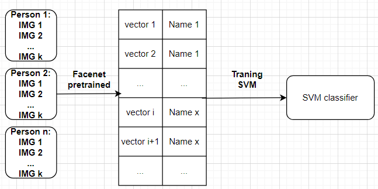
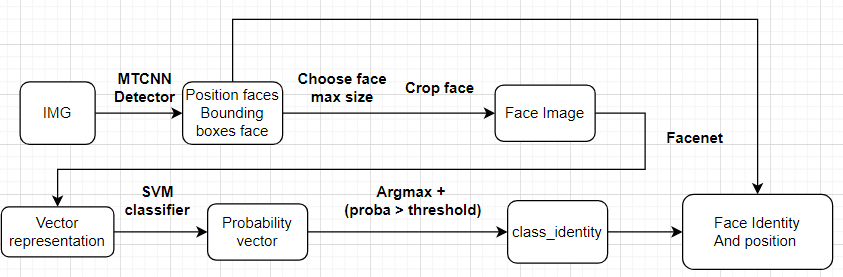

Các bước chạy repo này:
- B1: Hãy clone repo này về máy của bạn.
"git clone https://github.com/quangtuan-0504/FACE_RECOG_with_FACENET_Pytorch_MTCNN_SVM.git".
- B2: Trong thư mục vừa clone về hãy tạo một môi trường ảo để chứa các thư viện cần thiết.
- B3: Chạy pip "install -r requirement.txt" để cài các thư viện.
- B4: Hãy thêm hình ảnh của những người cần nhận dang vào thư mục DATABASE_FACE theo format mẫu đã cho trong đó.
- B5: Chạy file train_classifier.py bạn sẽ nhận được model tương ứng với ảnh train của bạn.
- B6: Chạy file main.py để xem kết quả.
